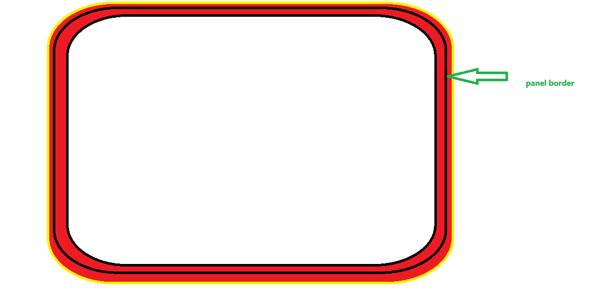

这是一个关于项目的待解决问题文档，下面是我要提出的问题，分析每一个问题出现的原因并确定解决方案，解决文档里的每一个问题后，重新验证问题是否已经被修复，若验证成功则将该问题标识为已修复。

**待修复问题**
暂无

**已修复问题**
1. Dean 怎么还是说中文，不是改成说英文了吗？
原因分析：
之前只在 TTS 音色层面切到了 Dean，但节目开场、聊天回复、接歌串场、触发推荐这些上游文案提示词仍然强制要求中文，所以 Dean 实际上是在用英文男声音色读中文文案。
解决方案：
新增独立的 DJ 文案语言判断逻辑，把 Dean 预设统一切到英文文案链路；同步修改了聊天回复、节目开场、节目重编、接歌串场、触发推荐等提示词，让 say / ttsText 在 Dean 模式下输出自然英文，冰糖模式保持中文。
验证结果：
backend 构建通过；backend 全量测试通过（81/81）。新增和更新的测试覆盖了 Dean 模式下的提示词语言要求，确认聊天回复和节目生成路径都会明确要求英文输出。

2. 增加音效切换功能，前端的按钮切换依旧是在 playerPanel 的齿轮里面。保留当前的音乐波浪效果，新增一个沿 panel border 内外约 20px 范围逐渐亮起、逐渐熄灭的边框呼吸效果。
原因分析：
原来只有单一的播放态外圈波浪光效，没有可切换的音效模式，也没有贴近 panel 边界的呼吸式发光层。
解决方案：
在 PlayerPanel 的齿轮菜单里新增 AUDIO FX 入口；保留原有 WAVE 效果，同时新增 BORDER PULSE 模式。新模式将发光集中在主面板边界附近，通过内外两层边框光晕做渐亮渐灭动画，并把设置持久化到本地，刷新后仍保留选择。
验证结果：
frontend 构建通过；frontend 测试通过（5/5）。新增测试验证了音效模式解析逻辑，现有结构测试继续通过，确认底栏和播放区相关结构未被这次改动破坏。
